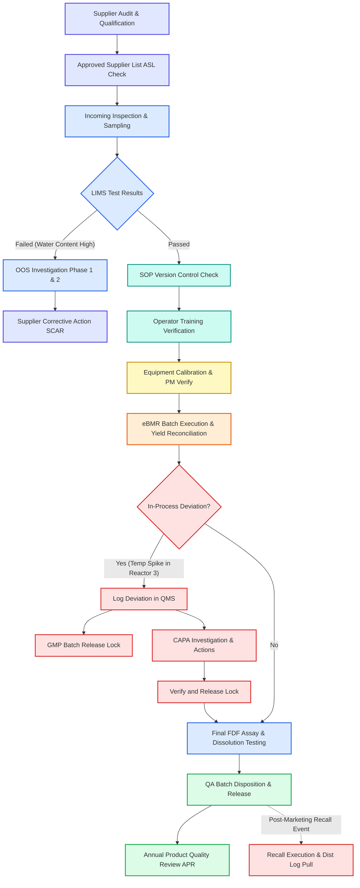

# Quality Management System (QMS) Workflow in Pharmaceutical Manufacturing

**Target Context:** Understanding QMS daily operations in life sciences, specifically mapping product lifecycles.  
**Examples Used:**
*   **Active Pharmaceutical Ingredient (API):** Amoxicillin Trihydrate (Chemical drug substance manufactured in bulk)
*   **Finished Dosage Form (FDF):** Amoxicillin 500mg Capsules (Dosage form manufactured by blending API with excipients, encapsulating, and packaging)

---

## 1. What is QMS in Pharma Operations?

Pharmaceutical manufacturers operate under strict regulatory frameworks (e.g., FDA Current Good Manufacturing Practice - cGMP, ICH Guidelines, and EU GMP). A **Quality Management System (QMS)** acts as the central software hub that governs all processes, documents, deviations, corrections, and certifications. It ensures that every batch of drug is manufactured consistently, safely, and transparently, adhering to the core principle of **ALCOA+** (Attributable, Legible, Contemporaneous, Original, Accurate, Complete, Consistent, Enduring, Available).

---

## 2. API vs. FDF Lifecycle Mapping

To illustrate QMS workflows, we will trace the manufacturing relationship between:
1.  **Amoxicillin Trihydrate (API):** Synthesized in a bulk chemical plant, crystallized, milled, and packaged in fiber drums.
2.  **Amoxicillin 500mg Capsules (FDF):** Formulated in a formulation plant, blending the API with excipients (magnesium stearate, microcrystalline cellulose), filling it into gelatin capsule shells, blister-packing, and carton-packaging.

---

## 3. Step-by-Step Lifecycle QMS Workflow

Below is the chronological journey of these products through the QMS modules:

### Step 1: Raw Material Sourcing & Supplier Quality (Supplier Quality Module)
*   **Action:** The FDF manufacturer must procure *Amoxicillin Trihydrate (API)* from a qualified source.
*   **QMS Interaction:** The purchasing system queries the **Approved Supplier List (ASL)** within the QMS. Only suppliers (e.g., "AmoxiChem Bulk Ltd") with an "Active/Qualified" status can receive purchase orders. 
*   **SCAR Action:** If a supplier's annual audit is overdue, the QMS triggers an automated block, preventing purchase orders until the **Supplier Quality Module** registers a successful audit or risk-assessment waiver.

### Step 2: Sourcing, Receiving, and Lab Testing (QC & LIMS Module)
*   **Action:** The API drums arrive at the FDF warehouse.
*   **QMS Interaction:** A warehouse operator logs the receipt. The QMS automatically places the API inventory under a **"Quarantine"** status and generates a sampling request in the **QC & LIMS Module**.
*   **OOS Investigation:** The QC analyst tests the API for water content (specification: 11.5% to 14.5%). The HPLC balance reads 15.2% (Out of Specification - OOS).
    1.  *Phase 1 Investigation:* The analyst registers the **OOS event** in the QMS. The QMS lock blocks warehouse release. The QA team investigates lab errors (e.g., improper drying, instrument calibration issue).
    2.  *Phase 2 Investigation:* If no lab error is found, it escalates to a manufacturing investigation. A **Supplier Corrective Action Request (SCAR)** is automatically dispatched through the QMS portal to the API manufacturer to resolve the moisture issue.

### Step 3: SOP Versioning & Mandatory Training (Docs & Training Modules)
*   **Action:** Formulation operators must set up the capsule encapsulation machine.
*   **QMS Interaction:** Before starting, the executed **eBMR (Electronic Batch Manufacturing Record)** checks if operators have completed training on the current revision of *SOP-PROD-045: Weight Verification of Encapsulated Products*.
*   **Interlock:** If the SOP was updated two days ago, and an operator has not completed the digital training assignment, the QMS flags them as "Not Qualified" and prevents their e-signature from initiating the machine run.

### Step 4: Asset Maintenance & Calibration (Asset Management Module)
*   **Action:** Running the capsule filling machine.
*   **QMS Interaction:** The eBMR queries the **Asset Management Module** using the encapsulation machine’s unique equipment ID.
*   **Interlock:** If the machine’s critical weighing scale's annual calibration was due yesterday and is now marked "Overdue", the QMS locks the batch execution screen, preventing operators from proceeding until calibration is logged and approved.

### Step 5: Batch Execution & In-Process Deviations (Quality Events Module)
*   **Action:** During encapsulation, a temperature sensor spikes in the hopper.
*   **QMS Interaction:** The operator creates a **Deviation** record in QMS.
*   **AI Drafting:** The QMS uses AI to read the operator's description ("Hopper temperature exceeded 35°C for 12 minutes"), links it to the batch number, pulls historical deviations, and suggests:
    *   *Root Cause:* Friction in dosing disk due to formulation powder sticking.
    *   *Immediate Action:* Halt encapsulation, quarantine the capsules made during the 12-minute window, and inspect dosing disk.
    *   *CAPA Draft:* (1) Modify maintenance SOP to increase dosing disk cleaning frequency, (2) Update blend formulation moisture targets.
*   **GMP Interlock:** The QMS automatically locks the batch status to "On Hold," preventing final packaging until the deviation is formally investigated, closed, and signed off by QA.

### Step 6: Final Release & Annual Product Quality Review (Oversight & Review Module)
*   **Action:** The FDF batch completes packaging and passes final QC testing.
*   **QMS Interaction:** Once all raw material tests, batch records, calibration certificates, and deviations are signed off, the QA Director uses the **QA Disposition Hub** to sign the e-release, updating the batch status from "Quarantine" to "Released".
*   **PQR Compilation:** At the end of the year, the **Oversight Module** pulls data from all Amoxicillin 500mg Capsule runs to compile the **Product Quality Review (PQR)**, automatically plotting yield trends, OOS frequencies, and deviation logs to prove process stability to the FDA.

### Step 7: Product Recall Escalation (Critical Quality Event)
*   **Action:** A recall is initiated if a defect is found post-market (e.g. a customer reports capsules containing underfilled doses, or a 12-month stability check shows impurity limits are breached).
*   **QMS Interaction:** The QA head registers a **Recall Incident** in the QMS.
*   **Genealogy Tracing:** QMS immediately uses the material registry to trace the active API batch code back to its raw material source and forward to all distributed batches. Within minutes, the system extracts the exact distribution log (which pharmacies, wholesalers, and markets received the specific lot numbers) so targeted recall notices can be sent out immediately.
